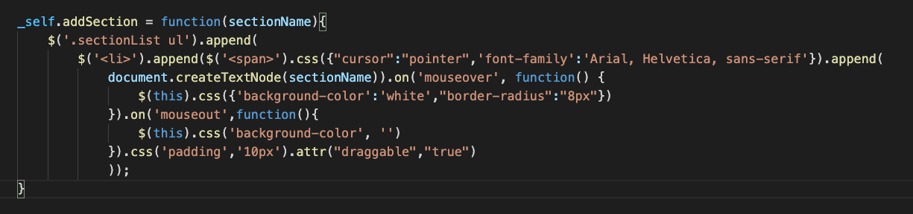

# js-library-libinyu

### Link to landing page: https://safe-brushlands-94643.herokuapp.com/example.html
### Link to documentation: https://safe-brushlands-94643.herokuapp.com/pages/documentation.html

## Getting Started
To get started on using the library, please include the view.js script file,
as well as the style.css in your html file. Also, since the library utilizes external
library 'jQuery', please also include jQuery in your html file as well.(Note: the 
current link for including jQuery is following: https://ajax.googleapis.com/ajax/libs/jquery/3.5.1/jquery.min.js).

Below are some implementation of several basic functionalities. For more details of all the functionalities, please see the API section below.

### Adding sections: user adds the sections to display in the list to fill the panels.

### Sliding side panel: user can drag to widen or narrow the width of the side panel.

### Drag and drop: user can drag and drop sections to rearrange the order.

### Swap between format/layout: user can change the layout of the panel through clicking the button.
